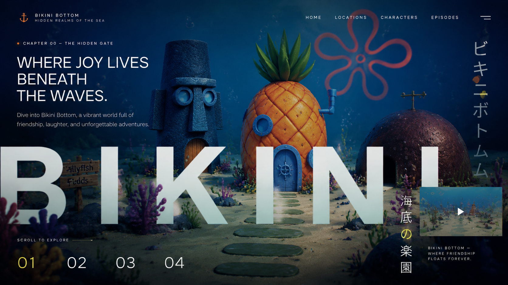

# BubbleBorough

An original single-page underwater WebGL town: a playful scroll through glowing reef houses, coral gardens, bubbles, and soft sea-floor light.



## What It Does

- Moves a live Three.js camera through an underwater cartoon reef town as the page scrolls.
- Builds the main homes, sandy path, coral props, bubbles, jellyfish, surface rays, and haze procedurally.
- Layers local foreground artwork over the 3D world for depth and editorial composition.
- Includes chapter navigation, responsive layout, reduced-motion behavior, and a local-only runtime.

## How It Is Made

BubbleBorough is a deliberately small static site. `index.html` contains the document structure, CSS, procedural Three.js scene construction, scroll choreography, and interaction logic. A vendored Three.js build is copied locally from the Kage project, so there is no package manager or build step.

The project follows Kage's technical pattern but changes the world: the temple becomes an original underwater town, mist becomes blue haze, falling leaves become bubbles and jellyfish, and foreground grasses become coral and seaweed overlays.

## Run Locally

From the project root, run:

```bash
python -m http.server 4174 --bind 127.0.0.1
```

Then visit:

```text
http://127.0.0.1:4174/
```

Opening `index.html` directly also works in many browsers, but a local server is recommended for consistent asset loading.

## Project Structure

```text
BubbleBorough/
├── index.html
├── PROMPT.md
├── README.md
├── assets/
│   └── image.png
└── secret-pathways-assets/
    ├── three.min.js
    ├── foreground/
    └── generated/
```

## Asset Note

The runtime uses local foreground artwork for coral, sea grass, bubbles, jellyfish, and reef texture. The 3D town itself is generated in code so camera movement, parallax, and lighting remain live.
